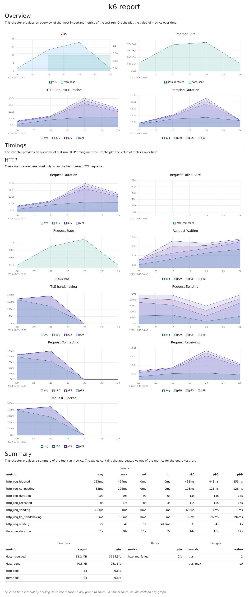

# Jumia Holiday Sales Testing

This Github project is a blackbox test of the Jumia e-commerce website and a load testing analysis for the December festive period. The blackbox testing is a prototype of how to identify any potential issues in the functionality of the Jumia e-commerce website, ensuring a smooth user experience for customers. 

Additionally, the load testing analysis will help determine if the website can handle increased traffic during the busy December festive period, ensuring it remains responsive and accessible to all users. 


  

## Running Tests

To run tests, run the following command

```bash
  pip install -r requiremennts
  python -m pytest --html=report.html
```

To run the load tests, you must have xk6 (k6 modified) installed. Then:

```bash
    k6 run --out dashboard=export=test-report.html script.js
```


## Summary of Load Testing

